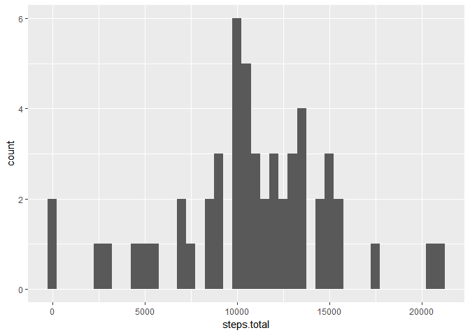
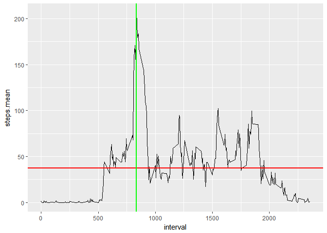
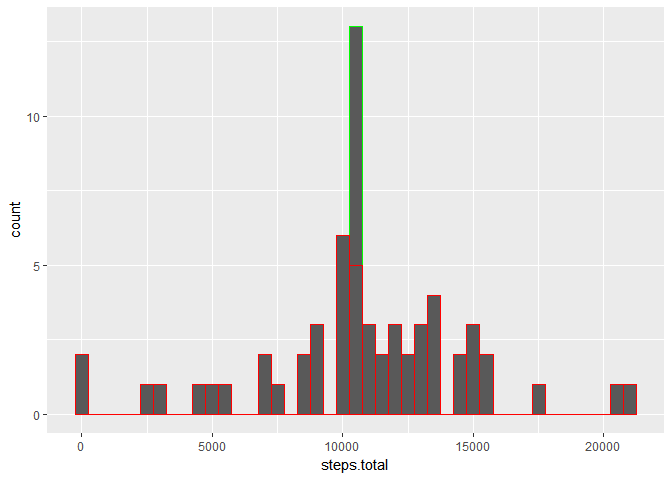
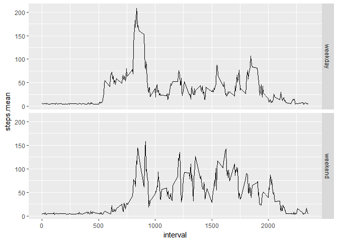

# Reproducible Research: Peer Assessment 1


## Loading and preprocessing the data

```r
#load raw data from CSV file
data.raw <- read.csv(unz(description = "activity.zip", filename = "activity.csv"), header = TRUE)

#constract timestamp from date and 5-min intevals and append it as column to data.raw
data.raw <- cbind(data.raw, 
                  #convert interval into timestamp
                  paste(substr(sprintf("%04d", data.raw$interval), 1, 2), 
                        substr(sprintf("%04d", data.raw$interval), 3, 4),
                        sep = ":"
                       )
                  )

#assign meaningful names
names(data.raw) <- c("steps", "date", "interval", "time")

#show raw data sample
str(data.raw)
```

```
## 'data.frame':	17568 obs. of  4 variables:
##  $ steps   : int  NA NA NA NA NA NA NA NA NA NA ...
##  $ date    : Factor w/ 61 levels "2012-10-01","2012-10-02",..: 1 1 1 1 1 1 1 1 1 1 ...
##  $ interval: int  0 5 10 15 20 25 30 35 40 45 ...
##  $ time    : Factor w/ 288 levels "00:00","00:05",..: 1 2 3 4 5 6 7 8 9 10 ...
```


## What is mean total number of steps taken per day?

```r
#create new table with total daily steps
data.steps.daily.agg <- aggregate(steps ~ date, data = na.omit(data.raw), FUN = sum)

#assign meaningful names
names(data.steps.daily.agg) <- c("date", "steps.total")

#plot the historgam
ggplot(data = data.steps.daily.agg, aes(x = steps.total)) + geom_histogram(na.rm = TRUE, binwidth = 500)
```

<!-- -->


```r
#calculate mean and median for steps across all days
steps.daily.mean <- as.integer(mean(data.steps.daily.agg$steps.total, na.rm = TRUE))
steps.daily.meadian <- as.integer(median(data.steps.daily.agg$steps.total, na.rm = TRUE))
```

Daily steps mean is 10766 and daily steps median is 10765


## What is the average daily activity pattern?

```r
#create table with means of steps by inteval.
data.steps.interval.agg <- aggregate(steps ~ interval + time, data = na.omit(data.raw), FUN = mean)

#assign meaningful names
names(data.steps.interval.agg) <- c("interval", "time", "steps.mean")
```


```r
#step.interval.mean.max captures the max mean steps accross all intervals
step.interval.mean.max <- max(data.steps.interval.agg$steps.mean)
step.interval.mean.max.interval <- subset(data.steps.interval.agg, steps.mean == step.interval.mean.max)$interval
step.interval.mean.max.time <- subset(data.steps.interval.agg, steps.mean == step.interval.mean.max)$time

#plot time series of 5-minute interval
ggplot(data = data.steps.interval.agg) + 
    geom_line(mapping = aes(x = interval, y = steps.mean)) + #plot steps.mean (y-axis) over intervals (x-axis)
    geom_hline(mapping = aes(yintercept = mean(steps.mean)), size = 1, colour = "red") + #plot mean line
    geom_vline(mapping = aes(xintercept = step.interval.mean.max.interval), size = 1, colour = "green") #mark inteval with max steps
```

<!-- -->

The maximum average of steps of 206.16981132 was captured in the interval 835 that corresponds to 08:35 o'clock

## Imputing missing values
Determine the number of intervals with missing data

```r
intervals.missing.data.count <- nrow(subset(data.raw, is.na(data.raw) == TRUE))
```
The total number of intervals with missing data is 2304.

For every interval with missing step count, a random number will be generated using normal distribution with mean set to maximum 


```r
#caclulate steps daily mean and sd as 1/5 of mean
steps.mean.daily <- as.integer(mean(na.omit(data.raw)$steps))
steps.sd.daily <- as.integer(steps.mean.daily / 5)

#generate filler values for missing steps as random values using normal distribution with steps daily mean and std. div.
#as defined above
data.missing.values <- as.integer(rnorm(intervals.missing.data.count, mean = steps.mean.daily, sd = steps.sd.daily))

#apply filler values to the records with missing steps
data.raw.impuded <- subset(data.raw, is.na(steps) == TRUE)
data.raw.impuded$steps <- data.missing.values

#create a new dataset with all values complete
data.steps.complete <- rbind(subset(data.raw, is.na(steps) == FALSE),
                             data.raw.impuded)

#create new dataset with daily totals for the complete data
data.steps.complete.agg <- aggregate(steps ~ date, data = data.steps.complete, FUN = sum)

#assign meaningful names
names(data.steps.complete.agg) <- c("date", "steps.total")

str(data.steps.complete.agg)
```

```
## 'data.frame':	61 obs. of  2 variables:
##  $ date       : Factor w/ 61 levels "2012-10-01","2012-10-02",..: 1 2 3 4 5 6 7 8 9 10 ...
```


```r
#plot hsitgrams comparing total daily steps in the original and complete (impuded) data sets
ggplot() + geom_histogram(data = data.steps.complete.agg, aes(x = steps.total), na.rm = TRUE, binwidth = 500, colour = "green") +
           geom_histogram(data = data.steps.daily.agg, aes(x = steps.total), na.rm = TRUE, binwidth = 500, colour = "red")
```

<!-- -->


```r
#calculate mean and median for steps across all days for complete (impuded) dataset
steps.complete.daily.mean <- as.integer(mean(data.steps.complete.agg$steps.total, na.rm = TRUE))
steps.complete.daily.meadian <- as.integer(median(data.steps.complete.agg$steps.total, na.rm = TRUE))
```


Both phenomena is due to the chosen impuding strategy that was based on average steps value.

## Are there differences in activity patterns between weekdays and weekends?

```r
#append a new column is.weekend to "complete" dataset (default value FALSE)
new.names <- append(names(data.steps.complete), "is.weekend")
data.steps.complete <- cbind(data.steps.complete, 
                             ifelse(weekdays(as.Date(data.steps.complete$date), abbr = TRUE) %in% c("Sat", "Sun"), "weekend", "weekday"))
#capture names
names(data.steps.complete) <- new.names


#create table with means of steps by inteval and weekday identifier.
data.steps.complete.interval.agg <- aggregate(steps ~ interval + time + is.weekend, data = data.steps.complete, FUN = mean)

#assign meaningful names
names(data.steps.complete.interval.agg) <- c("interval", "time", "is.weekend", "steps.mean")

#plot two-facet time series comparing weekend and weekday step means
ggplot(data = data.steps.complete.interval.agg) + 
    geom_line(mapping = aes(x = interval, y = steps.mean)) + #plot steps.mean (y-axis) over intervals (x-axis)
    facet_grid(is.weekend ~ .)
```

<!-- -->
